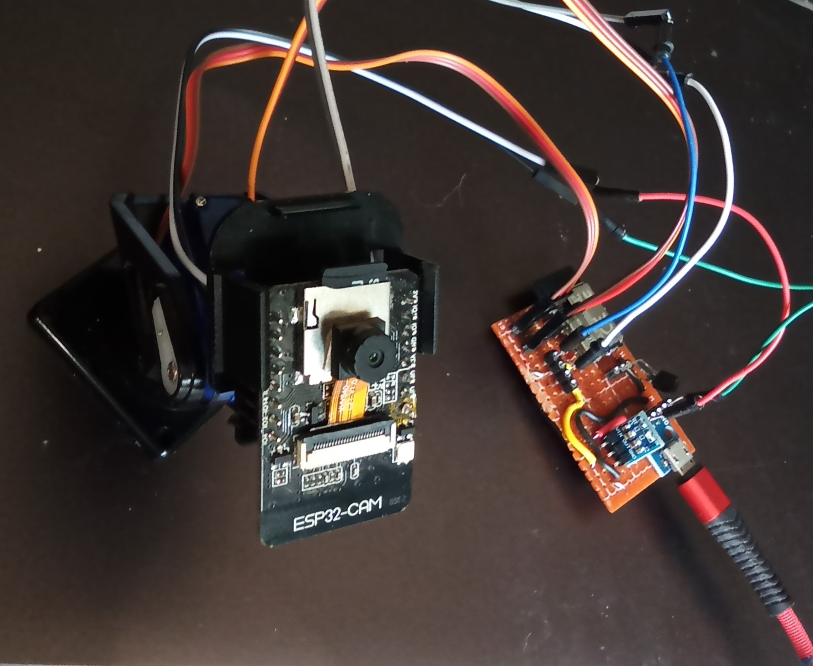

# ESP32-IO_Extender

ESP32 application to act as an IO Extender for another ESP. For example the ESP32 Camera module used by the ESP32-MJPEG2SD app has very few free pins to support peripherals such as pan / tilt servos. A low cost module such as the ESP32-C3FN4 can be used to provide additional pins, as in image below, providing pan and tilt servos and a DS18B20 temperature sensor:

   

## Only use this app if you are familiar with coding and electronics, and can fix issues yourself

## Design

The ESP32-IO_Extender communicates with its client using a uart connection. The ESP32-C3 has 2 uarts, UART0 is used for serial communication, so UART1 is used to communicate with the other ESP. 

External peripherals should have a low data rate and not a require a real time response to be supplied to the client. Peripherals that need a clocked data stream such as microphones are not suitable.

## Installation

Download GitHub files into the Arduino IDE sketch folder, removing `-main` from the application folder name.
Select the required board module, eg `ESP32C3 Dev Module`.
Compile using arduino core v2.x or V3.x (min v3.0.3) with Partition Scheme: `Minimal SPIFFS (...)`. 
 The client app and IO Extender app must be compiled with the same version of the `peripherals.cpp` file.

To load the app on the ESP32-C3FN4 for the first time, use a pin compatible ESP8266 Code Burner shown in image above, connecting the IO15 header to 3V3. 

On first installation, the application will start in wifi AP mode - connect to SSID: **ESP_IO_Extender_...**, to allow router and password details to be entered via the web page on 192.168.4.1. The configuration data file (except passwords) is automatically created, and the application web pages automatically downloaded from GitHub to the SD card **/data** folder when an internet connection is available. 

Subsequent updates to the application, or to the **/data** folder contents, can be made using the **OTA Upload** tab. The **/data** folder can also be reloaded from GitHub using the **Reload /data** button on the **Edit Config** tab,  or by using a WebDAV client on `ip_address/webdav`.  

Three connections need to be made with the client ESP32:
* IO Extender TX to client RX
* IO Extender RX to client TX
* Common GND

If flashing over serial to an ESP which has RX0 / TX0 connected to another ESP, disconnect or power off the other ESP, or use OTA.

To use IO Extender in the client app eg [ESP32-MJPEG2SD](https://github.com/s60sc/ESP32-CAM_MJPEG2SD/releases/tag/v9.9.4), then under its **Peripherals** button:
* Set `Use another ESP as IO Extender`
* To identify that a pin on the IO Extender is to be used, add `100` to the IO Extender pin number, eg to use pin `5` on the IO Extender, enter `105`.
* Enter pin numbers for `UART1 RX` and `UART1 TX`

The ESP camera module has 3 UARTs, but due to a shortage of pins only pins 4, 12, 33 are available for UART1 and local peripherals. To free up 2 pins, UART0 can be repurposed. Under the ESP32-MJPEG2SD **Peripherals** button, set `Use UART0 for IO Extender`. Use pin numbers 3 (RX0) and 1 (TX0) for `UART1 RX` and `UART1 TX` respectively.  
Once the camera app has started up, its serial monitor is no longer available, but logging can be viewed via the web page.

Browser functions only tested on Chrome.

## Configuration

The IO Extender web page has the following tabs:

* **Show Log**: Opens web socket to view log messages dynamically.

* **Edit Config**:

  * **Reboot ESP**: Restart the ESP to apply some configuration changes.

  * **Clear NVS**: Clear current passwords.

  * **Reload /data**: Reload data files from github.

  * **Wifi**: WiFi and webserver settings.

  * **Peripherals**: Current peripherals are servos, PIR, Led lamp (PWM or WS2812), DS18B20 temperature sensor, voltage monitoring
      * Set UART1 RX and TX pins.
      * Enable / disable peripherals. DS18B20 needs `#define USE_DS18B20 true` in `appGlobals.h`.
      * Set pin numbers used by peripherals.
      * Set any parameters for peripherals.

  * **Save**: Make configuration changes persist over ESP reboots.

* **OTA Update**: Update application bin file or files in **/data** folder using OTA.
